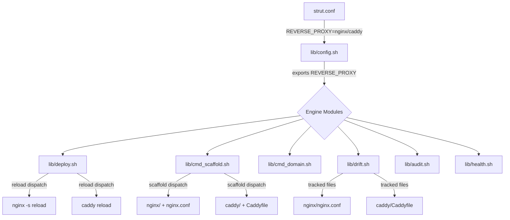

# Design Document: Pluggable Reverse Proxy

## Overview

This feature introduces a pluggable reverse proxy abstraction into strut's engine so that proxy-specific behavior (reload, scaffold, domain/SSL, drift, audit, health) is dispatched based on a `REVERSE_PROXY` config setting rather than hardcoded to nginx. Nginx remains the default; Caddy is the first alternative.

The design follows strut's core principle: no hardcoded values in the engine — everything config-driven. The existing `lib/config.sh` → `strut.conf` pattern (used by `REGISTRY_TYPE`) serves as the blueprint. Each engine module that currently references nginx directly will be updated to read `REVERSE_PROXY` and dispatch accordingly.

### Research Summary

Key findings from codebase analysis:

- **Config pattern**: `lib/config.sh` already implements the `load_strut_config` pattern — source `strut.conf`, apply defaults, export. Adding `REVERSE_PROXY` follows the same shape as `REGISTRY_TYPE`.
- **Deploy reload**: `lib/deploy.sh` → `deploy_stack()` currently hardcodes `$compose_cmd ps nginx` and `$compose_cmd exec -T nginx nginx -s reload`. This is the primary dispatch point.
- **Scaffold**: `lib/cmd_scaffold.sh` → `cmd_scaffold()` creates `nginx/` directory and writes a hardcoded `nginx.conf`. Needs a conditional branch.
- **Domain/SSL**: `lib/cmd_domain.sh` → `cmd_domain()` calls `configure-domain.sh` on VPS, pulls back `nginx/conf.d/<stack>.conf`, and restarts `nginx`. Caddy path skips certbot (Caddy has built-in ACME) and pulls back `Caddyfile` instead.
- **Drift**: `lib/drift.sh` has a hardcoded `DRIFT_TRACKED_FILES` array containing `nginx/nginx.conf`. Needs to swap to `caddy/Caddyfile` when `REVERSE_PROXY=caddy`. The `drift_validate_syntax` function already has a `nginx.conf)` case — needs a `Caddyfile)` case.
- **Audit**: `lib/audit.sh` → `_audit_nginx()` collects nginx containers/configs. Needs a parallel `_audit_caddy()` function.
- **Health**: `lib/health.sh` → `health_check_network()` hardcodes port 80. Caddy listens on both 80 and 443 by default. Also needs to support `PROXY_PORTS` override in `services.conf`.
- **Dry-run**: `lib/deploy.sh` dry-run block shows `nginx -s reload`. Needs to show the correct reload command per proxy type.
- **Template**: `templates/strut.conf.template` needs a `REVERSE_PROXY` entry.

## Architecture

The pluggable proxy follows a **dispatch-by-config** pattern, consistent with how `REGISTRY_TYPE` drives registry auth in `lib/registry.sh`.



### Design Decisions

1. **Config value doubles as compose service name** — `REVERSE_PROXY=nginx` means the compose service is named `nginx`; `REVERSE_PROXY=caddy` means the service is named `caddy`. This avoids a separate `PROXY_SERVICE_NAME` config key and matches how operators already name their services.

2. **Validation at config load time** — Invalid `REVERSE_PROXY` values are caught in `load_strut_config` via `fail()`, not at each call site. This is consistent with how a bad `REGISTRY_TYPE` would be caught.

3. **No proxy abstraction layer / interface file** — Each module handles its own `case "$REVERSE_PROXY"` dispatch inline. The proxy-specific logic in each module is small (2-5 lines per branch), so a shared abstraction would add indirection without reducing complexity. If a third proxy is added later, a shared `lib/proxy.sh` can be extracted.

4. **Drift tracked files are dynamic** — Instead of a static array, `drift_get_tracked_files()` returns the list based on `REVERSE_PROXY`. The static `DRIFT_TRACKED_FILES` array is replaced with a function call.

5. **Caddy auto-HTTPS** — When `REVERSE_PROXY=caddy`, the domain command skips certbot steps entirely. Caddy's built-in ACME handles certificate provisioning automatically when a domain is configured in the Caddyfile.

## Components and Interfaces

### 1. `lib/config.sh` — Config Loading

**Modified function: `load_strut_config()`**

Adds `REVERSE_PROXY` to the config loading and default-application logic.

```bash
# After existing defaults:
REVERSE_PROXY="${REVERSE_PROXY:-nginx}"
export REVERSE_PROXY

# Validation
case "$REVERSE_PROXY" in
  nginx|caddy) ;;
  *) fail "Invalid REVERSE_PROXY='$REVERSE_PROXY' in strut.conf (valid: nginx, caddy)" ;;
esac
```

### 2. `templates/strut.conf.template` — Config Template

Adds a commented `REVERSE_PROXY` entry:

```
# ── Reverse Proxy ──────────────────────────────────
# Supported types: nginx | caddy
# REVERSE_PROXY=nginx
```

### 3. `lib/deploy.sh` — Deploy Reload

**Modified function: `deploy_stack()`**

Replaces the hardcoded nginx reload block with a proxy-aware dispatch:

```bash
# Reload reverse proxy to pick up new container IPs
local proxy="${REVERSE_PROXY:-nginx}"
if $compose_cmd ps "$proxy" &>/dev/null && $compose_cmd ps "$proxy" | grep -q "Up"; then
  log "Reloading $proxy to refresh backend IPs..."
  case "$proxy" in
    nginx) $compose_cmd exec -T nginx nginx -s reload 2>/dev/null && ok "nginx reloaded" || warn "nginx reload failed" ;;
    caddy) $compose_cmd exec -T caddy caddy reload --config /etc/caddy/Caddyfile 2>/dev/null && ok "Caddy reloaded" || warn "Caddy reload failed" ;;
  esac
else
  warn "$proxy container not running — skipping reload"
fi
```

**Dry-run block** also updated to show the correct reload command.

### 4. `lib/cmd_scaffold.sh` — Scaffold Templates

**Modified function: `cmd_scaffold()`**

Replaces the hardcoded nginx directory creation with a proxy-aware branch:

```bash
local proxy="${REVERSE_PROXY:-nginx}"
case "$proxy" in
  nginx)
    mkdir -p "$target/nginx/conf.d"
    # ... existing nginx.conf content ...
    ;;
  caddy)
    mkdir -p "$target/caddy"
    cat > "$target/caddy/Caddyfile" <<'CADDY_EOF'
# Caddyfile — reverse proxy configuration
# See https://caddyserver.com/docs/caddyfile
{
    # Global options
}

# :80 {
#     reverse_proxy app:8000
# }
CADDY_EOF
    ;;
esac
```

The "Next steps" output references the correct proxy config directory.

### 5. `lib/cmd_domain.sh` — Domain/SSL Configuration

**Modified function: `cmd_domain()`**

Adds a proxy-aware branch:

- **nginx path**: Current behavior unchanged (calls `configure-domain.sh`, pulls nginx conf, restarts nginx).
- **caddy path**: Updates the Caddyfile on VPS with the domain block, reloads Caddy (no certbot needed), pulls back the Caddyfile.

```bash
local proxy="${REVERSE_PROXY:-nginx}"
case "$proxy" in
  nginx)
    # ... existing nginx domain logic ...
    ;;
  caddy)
    # Update Caddyfile on VPS, reload Caddy, pull back Caddyfile
    # Skip certbot — Caddy handles ACME automatically
    ;;
esac
```

### 6. `lib/drift.sh` — Drift Detection

**New function: `drift_get_tracked_files()`**

Returns the tracked files list dynamically based on `REVERSE_PROXY`:

```bash
drift_get_tracked_files() {
  local base_files=(
    "docker-compose.yml"
    ".env.template"
    "backup.conf"
    "repos.conf"
    "volume.conf"
  )
  local proxy="${REVERSE_PROXY:-nginx}"
  case "$proxy" in
    nginx) base_files+=("nginx/nginx.conf") ;;
    caddy) base_files+=("caddy/Caddyfile") ;;
  esac
  echo "${base_files[@]}"
}
```

The static `DRIFT_TRACKED_FILES` array is replaced with calls to this function.

**Modified function: `drift_validate_syntax()`**

Adds a `Caddyfile)` case:

```bash
Caddyfile)
  if command -v caddy &>/dev/null; then
    caddy validate --config "$file_path" >/dev/null 2>&1
    return $?
  fi
  ;;
```

### 7. `lib/audit.sh` — VPS Audit

**New function: `_audit_caddy()`**

Parallel to `_audit_nginx()`, collects Caddy containers and Caddyfile configs:

```bash
_audit_caddy() {
  local ssh_opts="$1" vps_user="$2" vps_host="$3" _sudo="$4" audit_dir="$5"
  log "Collecting Caddy configuration..."
  mkdir -p "$audit_dir/caddy"
  ssh $ssh_opts "$vps_user@$vps_host" \
    "${_sudo}docker ps --format '{{.Names}}' | grep -i caddy" \
    > "$audit_dir/caddy/caddy-containers.txt" 2>/dev/null || true
  # ... extract Caddyfile from containers, check system service ...
}
```

**Modified function: `audit_vps()`** — calls `_audit_caddy` after `_audit_nginx`.

**Modified function: `audit_generate_report()`** — includes Caddy section in report.

### 8. `lib/health.sh` — Health Check Network

**Modified function: `health_check_network()`**

Replaces the hardcoded `local -a ports=(80)` with proxy-aware defaults:

```bash
local proxy="${REVERSE_PROXY:-nginx}"
local -a ports=()

# Check for PROXY_PORTS override in services.conf
if [ -n "${PROXY_PORTS:-}" ]; then
  IFS=' ' read -ra ports <<< "$PROXY_PORTS"
else
  case "$proxy" in
    nginx) ports=(80) ;;
    caddy) ports=(80 443) ;;
  esac
fi
```

## Data Models

### Configuration Keys

| Key | File | Type | Default | Valid Values |
|-----|------|------|---------|-------------|
| `REVERSE_PROXY` | `strut.conf` | string | `nginx` | `nginx`, `caddy` |
| `PROXY_PORTS` | `services.conf` | space-separated ints | (derived from proxy type) | e.g. `80 443 8080` |

### Proxy Config Directory Layout

**nginx (existing)**:
```
stacks/<name>/
  nginx/
    nginx.conf
    conf.d/
      <stack>.conf
```

**caddy (new)**:
```
stacks/<name>/
  caddy/
    Caddyfile
```

### Proxy Dispatch Table

| Operation | nginx | caddy |
|-----------|-------|-------|
| Reload command | `nginx -s reload` | `caddy reload --config /etc/caddy/Caddyfile` |
| Compose service name | `nginx` | `caddy` |
| Config file (scaffold) | `nginx/nginx.conf` | `caddy/Caddyfile` |
| Drift tracked file | `nginx/nginx.conf` | `caddy/Caddyfile` |
| Syntax validation | `nginx -t` | `caddy validate --config` |
| SSL mechanism | certbot + `configure-domain.sh` | Caddy built-in ACME |
| Default ports | 80 | 80, 443 |
| Domain config pull path | `nginx/conf.d/<stack>.conf` | `caddy/Caddyfile` |


## Correctness Properties

*A property is a characteristic or behavior that should hold true across all valid executions of a system — essentially, a formal statement about what the system should do. Properties serve as the bridge between human-readable specifications and machine-verifiable correctness guarantees.*

### Property 1: Config parsing loads REVERSE_PROXY and defaults to nginx

*For any* `strut.conf` containing a random subset of config keys (including `REVERSE_PROXY`), after calling `load_strut_config`, every present key should have its specified value and every absent key should have its default — with `REVERSE_PROXY` defaulting to `nginx` when absent.

**Validates: Requirements 1.1, 1.2**

### Property 2: Invalid REVERSE_PROXY values are rejected

*For any* string that is not `nginx` or `caddy`, setting `REVERSE_PROXY` to that value in `strut.conf` and calling `load_strut_config` should cause a failure (via `fail()`).

**Validates: Requirements 1.3**

### Property 3: Scaffold creates correct proxy directory per REVERSE_PROXY

*For any* valid `REVERSE_PROXY` value (`nginx` or `caddy`), running `cmd_scaffold` should create the proxy-specific config directory (`nginx/` with `nginx.conf` and `conf.d/` for nginx, `caddy/` with `Caddyfile` for caddy) and the scaffold output should reference the correct proxy config directory.

**Validates: Requirements 3.1, 3.2, 3.3**

### Property 4: Drift tracked files include correct proxy config per REVERSE_PROXY

*For any* valid `REVERSE_PROXY` value, the drift tracked files list returned by `drift_get_tracked_files()` should include the proxy-specific config file (`nginx/nginx.conf` for nginx, `caddy/Caddyfile` for caddy) and should not include the other proxy's config file.

**Validates: Requirements 5.1, 5.2**

### Property 5: Health engine checks correct default ports per REVERSE_PROXY

*For any* valid `REVERSE_PROXY` value with no `PROXY_PORTS` override, the health engine's network port list should include port 80 for nginx, and both port 80 and port 443 for caddy.

**Validates: Requirements 7.1, 7.2**

### Property 6: PROXY_PORTS override replaces default proxy ports

*For any* space-separated list of valid port numbers set as `PROXY_PORTS` in `services.conf`, the health engine's network port list should contain exactly those ports, regardless of the `REVERSE_PROXY` value.

**Validates: Requirements 7.3**

### Property 7: Dry-run output shows correct proxy reload command per REVERSE_PROXY

*For any* valid `REVERSE_PROXY` value with `DRY_RUN=true`, the deploy execution plan output should contain the proxy-specific reload command (`nginx -s reload` for nginx, `caddy reload` for caddy).

**Validates: Requirements 8.1, 8.2**

## Error Handling

| Scenario | Handler | Behavior |
|----------|---------|----------|
| Invalid `REVERSE_PROXY` value in `strut.conf` | `load_strut_config()` | `fail()` with descriptive message listing valid values |
| Proxy container not running during deploy reload | `deploy_stack()` | `warn()` and skip reload — deploy still succeeds |
| Proxy reload command fails | `deploy_stack()` | `warn()` — non-fatal, deploy still reports success |
| Caddy validate fails during drift check | `drift_validate_syntax()` | `warn()` and skip file — same as existing nginx behavior |
| `PROXY_PORTS` contains non-numeric values | `health_check_network()` | Passed through to `ss`/`netstat` — will simply not match, reported as "not listening" |
| `caddy` binary not available for drift validation | `drift_validate_syntax()` | Skip validation, assume valid — same pattern as existing nginx fallback |

All error handling follows strut's existing conventions:
- `fail()` for fatal errors that should stop execution (invalid config)
- `warn()` for non-fatal issues that should be reported but not block operations
- Never bare `|| return 1` without a message

## Testing Strategy

### Property-Based Tests (BATS)

Each correctness property maps to a BATS test with 100 randomized iterations, following the existing pattern in `tests/test_config.bats`.

**Library**: BATS (Bash Automated Testing System) — already used by the project.

**Configuration**: 100 iterations per property test with randomized inputs.

**Test file**: `tests/test_proxy_config.bats`

| Property | Test Approach |
|----------|--------------|
| Property 1: Config parsing | Generate random strut.conf with random subset of keys including REVERSE_PROXY. Verify load_strut_config exports correct values and defaults. Tag: **Feature: pluggable-reverse-proxy, Property 1: Config parsing loads REVERSE_PROXY and defaults to nginx** |
| Property 2: Invalid values rejected | Generate 100 random strings (excluding "nginx" and "caddy"). Verify load_strut_config fails for each. Tag: **Feature: pluggable-reverse-proxy, Property 2: Invalid REVERSE_PROXY values are rejected** |
| Property 3: Scaffold dispatch | For each valid proxy type, run cmd_scaffold and verify correct directory structure and output text. Tag: **Feature: pluggable-reverse-proxy, Property 3: Scaffold creates correct proxy directory per REVERSE_PROXY** |
| Property 4: Drift tracked files | For each valid proxy type, call drift_get_tracked_files and verify correct proxy config file is included. Tag: **Feature: pluggable-reverse-proxy, Property 4: Drift tracked files include correct proxy config per REVERSE_PROXY** |
| Property 5: Health default ports | For each valid proxy type with no PROXY_PORTS, verify correct default ports. Tag: **Feature: pluggable-reverse-proxy, Property 5: Health engine checks correct default ports per REVERSE_PROXY** |
| Property 6: PROXY_PORTS override | Generate random port lists, set as PROXY_PORTS, verify health engine uses exactly those ports. Tag: **Feature: pluggable-reverse-proxy, Property 6: PROXY_PORTS override replaces default proxy ports** |
| Property 7: Dry-run output | For each valid proxy type with DRY_RUN=true, verify output contains correct reload command. Tag: **Feature: pluggable-reverse-proxy, Property 7: Dry-run output shows correct proxy reload command per REVERSE_PROXY** |

### Unit Tests (Examples and Edge Cases)

| Test | Type | Description |
|------|------|-------------|
| Template contains REVERSE_PROXY | Example | Verify `strut.conf.template` contains commented `REVERSE_PROXY` entry (Req 1.4) |
| Caddyfile template content | Example | Verify scaffolded Caddyfile contains placeholder reverse_proxy block (Req 3.4) |
| Drift syntax validation dispatch | Example | Verify `drift_validate_syntax` routes to correct validator for `nginx.conf` vs `Caddyfile` (Req 5.3, 5.4) |
| Default when REVERSE_PROXY absent | Edge case | Verify `REVERSE_PROXY` defaults to `nginx` when not in strut.conf (Req 1.2) |
| Proxy container not running | Edge case | Verify deploy skips reload with warning when proxy container is down (Req 2.3) |

### Existing Test Updates

- `tests/test_config.bats` Property 2 should be extended to include `REVERSE_PROXY` in the randomized key set
- `tests/test_scaffold.bats` should verify proxy-aware scaffold output
- `tests/test_no_hardcodes.bats` should verify no remaining hardcoded `nginx` references in engine dispatch paths (excluding the nginx-specific case branches)
